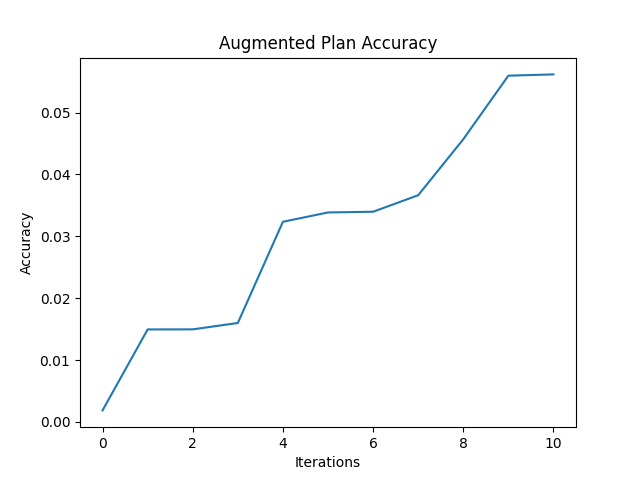

# Kitana-Data-Aug

## Data Augmentation for Kitana
This repository contains the code for data augmentation for Kitana. The code is written in Python and contains sample data, sample execution code, and the data augmentation code.

Please follow the instructions below to run the code.

### Instructions
1. Clone the repository
2. Make sure you are in the correct directory:
```bash
cd Kitana-Data-Aug
```
3. Run the following command to install the required libraries:
```bash
# If you are using python venv.
python3 -m venv venv
source venv/bin/activate
pip install -r requirements.txt
```

```bash
# If you are using conda, there is a environment.yml file in the repository.
conda env create -f environment.yml
```
3. Run the following command to execute the code:
```bash
python sample_execution.py
```

### Environment Notice
 - The code is tested on Python 3.9.19.
 - If you are running with cuda, and meet environment issues. Please be reminded that this code is tested under ` CUDA Version: 12.5 `

## Data Augmentation
This code is used to augment the data for Kitana. It will iterate through the data and apply the augmentation techiques (based on linear regression) each time.

### Sample Data Description
You can find the sample data in the `data\test_data` directory. There you can find two folders `buyer` and `seller` which contains the sample data for buyer and seller respectively.

`buyer` represents the data to be augmented. In each iteration, we will find a feature in the seller data and apply the augmentation technique to the buyer data.

`seller` represents the data to be used for augmentation.

### Sample Execution
The sample execution code displays a way to use the data augmentation code. It reads the sample data and iterate for 10 times on the seller datasets. 

It would create 100 sellers with 10000 features to search by default. But here we don't include them, you should create them on your device. You can change the number in this code block:
```python
    if create_df:
        buyer_df, buyer_features = create_dataframe(rows=10000, features=3, join_key_domains={'m': 100, 'n': 10}, prefix='b')
        buyer_df.to_csv("data/test_dataset/buyer/buyer_1.csv", index=False)
        print("buyer_df of 1000 rows and 10000 features has been created with join key being country and year")
        target_feature = buyer_features[0]  # 'b1'

        for i in tqdm(range(100), desc="Creating seller dataframes"):
            seller_df, features = create_dataframe(rows=10000, features=10000, join_key_domains={'m': 100, 'n': 10}, prefix=f's{i+1}_')
            seller_df.to_csv(f"data/test_dataset/seller/seller_{i+1}.csv", index=False)
            seller_dfs.append(f"data/test_dataset/seller/seller_{i+1}.csv")
```
Here, you can change rows and features to control the number of rows and features for both buyer and seller data.

### Acceleration
You may be confused by the `fit_by_residual` parameter in the `augment_data` function. This parameter is used to accelerate the augmentation process. If you set `fit_by_residual=True`, the code will fit the model by the residual of the buyer data and the seller data. This will accelerate the process. If you set `fit_by_residual=False`, the code will fit the model by the buyer data and the seller data. This will be slower than the former.
```python
search_engine = new_search_gpu.SearchEngine(data_market, fit_by_residual=fit_by_residual)
```

### Output
 - `augplan_acc: List`: The accuracy of the augmentation plan. It includes the accuracy of the augmented data for each iteration.
 - `augplan: List`: The augmentation plan. It includes the features that are used for augmentation for each iteration. There will be 4 items in the tuple of each iteration. They are: `seller_id`, `iteration`, `seller_name`, `feature_name`.
 - `result: pd.DataFrame`: The augmented data.
 - A plot of the accuracy of the augmented data for each iteration.
 

